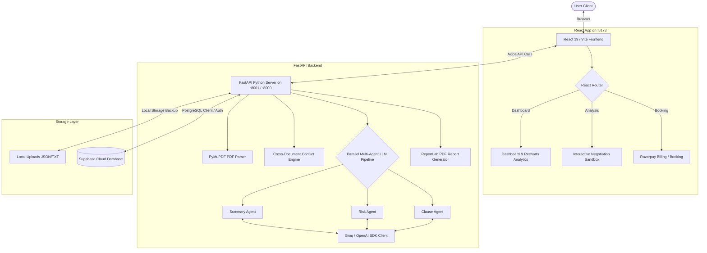

# ⚖️ Lexicon AI — Legal Document Intelligence & Practice Management Platform

[](https://react.dev)
[](https://fastapi.tiangolo.com)
[](https://supabase.com)
[](https://groq.com)
[](#)

Lexicon AI is an enterprise-grade Legal Tech and Practice Management platform. It automates legal document ingestion, executes a parallel multi-agent AI pipeline for clause analysis and risk classification, offers interactive negotiation sandboxes, manages scheduling/billing, and features real-time client-attorney collaboration — backed by Supabase cloud storage and local fallback cache mechanics.

---

## 📸 Key Features Matrix

### 1. Document Intelligence & AI Pipeline
*   **PDF Ingestion & Text Ingestion**: Upload multi-page contracts, letters, or paste raw text. Uses PyMuPDF for precise text parsing.
*   **Multi-Agent AI Pipeline**: Summary, Risk, and Clause agents execute concurrently in JSON mode, scoring contract risk profiles.
*   **Cross-Document Conflict Analysis**: Select multiple documents and run comparison jobs to detect mismatching liability limits, conflicting jurisdictions, and inconsistent payment timelines.
*   **Audit Report Generator**: Generates professional PDF contract briefs with executive summaries, risk charts, and signature blocks via ReportLab.

### 2. Legal Advisory & Sandbox
*   **Interactive Counterparty Negotiator**: A sandbox simulator matching a contract clause against configurable negotiator profiles (e.g. *Collaborative*, *Conservative*, *Aggressive*). Uses a dynamic consensus meter and AI counter-proposal suggestor.
*   **Contextual Contract Chat**: Ask specific questions regarding active contract text or seek general advisory leveraging broader workspace metadata (contacts, past filings).

### 3. Practice Management & Collaboration
*   **Client-Attorney Scheduling**: Interactive booking engine allowing clients to schedule consults with specialized lawyers.
*   **Razorpay Billing Integration**: Built-in payment gateway validating transaction receipts before confirming lawyer consultations.
*   **Secure Document Collaboration**: Share documents between lawyers and clients, write notes, and send direct messages in document-specific chat channels.
*   **Portfolio Analytics**: Visual analytics showing aggregated risk trends, document status distributions, and risk heatmaps using Recharts.

---

## 🏗️ System Architecture

The following diagram illustrates the workflow of the Lexicon AI system, from document upload to AI agent parsing and database persistence:



---

## 🛠️ Tech Stack & Dependencies

### Frontend (`./src`)
*   **Core**: React 19.1.0, React Router DOM 7.18.0
*   **Styles**: Tailwind CSS v4.3.1, Framer Motion 12.40.0
*   **Icons**: Lucide React
*   **Analytics**: Recharts 3.8.1

### Backend (`./smart_document/backend`)
*   **Core**: FastAPI 0.110+, Python 3.10+, Uvicorn
*   **LLM Interface**: OpenAI Python SDK, Groq (using JSON output schemas)
*   **Document Parsers**: PyMuPDF (`fitz`)
*   **PDF Generation**: ReportLab PDF library
*   **Validation**: Pydantic v2 Settings

### Database
*   **Engine**: PostgreSQL (managed via Supabase)
*   **Auth**: Supabase GoTrue authentication with Row-Level Security (RLS) policies

---

## 🔑 Environment Variables Reference

### Frontend Configuration (`.env` in root folder)
Create a `.env` file at the root of the project:
```env
VITE_API_URL=http://localhost:8001
VITE_SUPABASE_URL=https://<your-project-id>.supabase.co
VITE_SUPABASE_KEY=<your-supabase-anon-key>
VITE_RAZORPAY_KEY_ID=rzp_test_<your-razorpay-key>
```

### Backend Configuration (`.env` in `./smart_document/backend/`)
Create a `.env` file inside the `smart_document/backend` folder:
```env
GROQ_API_KEY=gsk_...                     # Your Groq API key
GROQ_MODEL=llama-3.1-8b-instant         # LLM Model identifier
GROQ_BASE_URL=https://api.groq.com/openai/v1

SUPABASE_URL=https://<your-project-id>.supabase.co
SUPABASE_KEY=<your-supabase-service-role-key-or-anon-key>

API_KEY=                                # Optional: API protection key
```

---

## 🚀 Local Setup & Installation

Follow these steps to configure and boot Lexicon AI locally:

### 1. Database Setup (Supabase)
1.  Log in to your [Supabase Dashboard](https://supabase.com).
2.  Create a new project.
3.  Go to the **SQL Editor** and run the query script located in [smart_document/backend/schema.sql](file:///c:/Users/srish/OneDrive/Desktop/lexiconai/lexicon/smart_document/backend/schema.sql). This configures profiles tables, appointments schemas, indexes, and custom authentication triggers to automatically assign user metadata roles (attorneys vs clients).

### 2. Backend Setup
Execute the following commands in your terminal:
```bash
# Navigate to the backend directory
cd smart_document/backend

# Create a virtual environment
python -m venv .venv

# Activate the virtual environment
# On Windows (PowerShell):
.venv\Scripts\Activate.ps1
# On Linux/macOS:
source .venv/bin/activate

# Install Python dependencies
pip install -r requirements.txt

# Start the FastAPI server (on port 8001 or 8000 depending on frontend config)
python -m uvicorn app.main:app --reload --port 8001
```

### 3. Frontend Setup
Open a separate terminal window and run:
```bash
# Ensure you are at the root of the repository
cd lexicon

# Install node dependencies
npm install

# Boot the Vite developer environment
npm run dev
```
Open your browser and navigate to `http://localhost:5173`.

---

## 👤 Seed / Login Accounts

You can test user roles using the default seeded attorney credentials:
*   **Lawyer Email**: `johndoe@lexicon.com` / `janesmith@lexicon.com`
*   **Client Email**: Register a new client account using the frontend sign-up page (roles are self-assigned during Auth).
*   **Password**: `password123`

---

## 📄 License
Lexicon AI is open-source software licensed under the [MIT License](https://opensource.org/licenses/MIT).